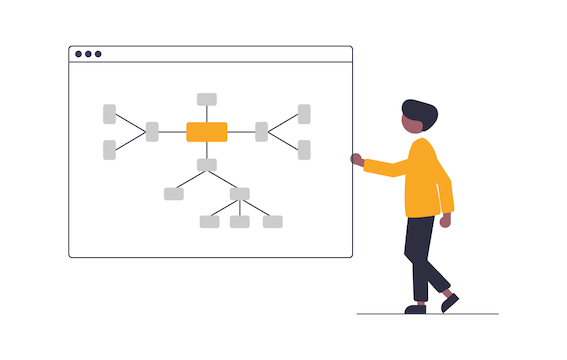

# GraphIAM

Traditionally, identity and access management has been implemented either by using directory services or by building a custom solution inside an application’s backend.
Hierarchical directory structures, however, can’t cope with the complex dependency structures found in multi-party distributed supply chains. And custom solutions that use non-graph databases to store identify and access data become slow and unresponsive as their datasets grow in size.
That’s why we will utilize graph database technology to run a mission-critical identity and access management solutions.

**Usecases:**
-
1. Create graph based repository to store IAM information metadata
2. Integrate for Authorization - Verity and alert approver and owners for any access request
3. Generate Audit Reports using graph IAM Repository
4. Detect 
   1. **Unauthorized access** - by tracing user through groups, roles and other attributes.
   2. **Lateral Movement** - by checking the route used by user to access a machine
5. Generate a dynamic level of trust

**Model-Entities**
-
1. Users
2. Role
3. Department
4. Region
5. User Group
6. Machine
7. Machine Group

**Model-Relationships**
-
1. User -*MANAGES*-> User
2. User -*HAS_ROLE*-> Role
3. User -*BELONGS_TO*-> Department
4. User -*FROM*-> Region
5. User -*MEMBER_OF*-> User Group
6. User -*HAS_ACCESS*-> Machine
7. User -*HAS_ACCESS*-> Machine Group
8. User -*OWNS*-> Machine
9. User -*OWNS*-> Machine Group
10. Machine -*MEMBER_OF*-> Machine Group
11. Machine -CONNECTS-> Machine

**Steps:**
-
1. Generate near realistic enterprise User information consisting of different departments and respective hierarchical roles. This information will be saved to an ***User.csv***
2. Generate random machine and machine groups and assigning them different owners from the the ***Users.csv***
3. Import the generated data from CSV into Neo4j using a cypher query. This will create entities and map required relationship between them. With this step our graph based repository for IAM metadata is ready.
